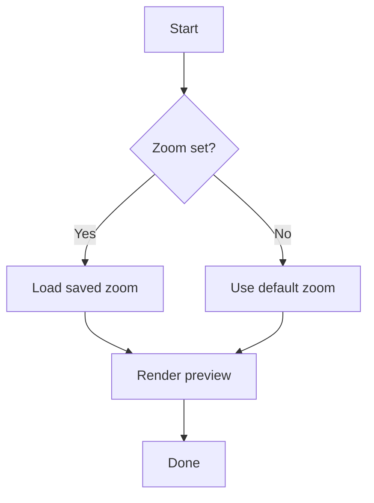
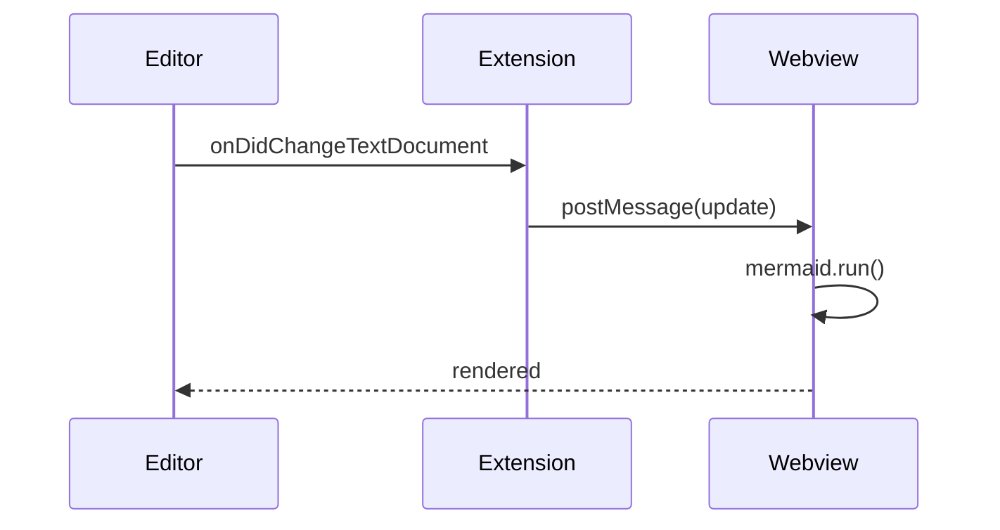
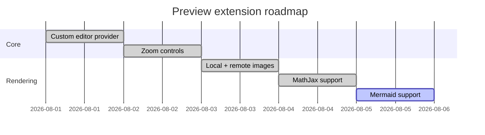
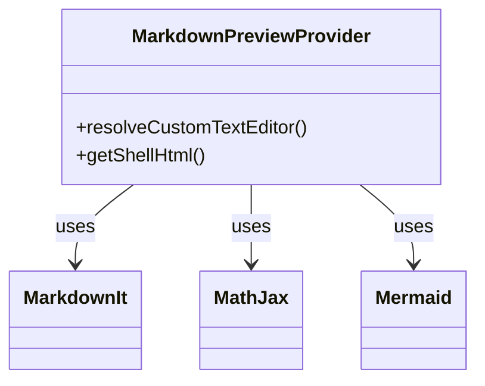

# Mermaid Example

## Flowchart

```mermaid
flowchart TD
  A[Start] --> B{Zoom set?}
  B -- Yes --> C[Load saved zoom]
  B -- No --> D[Use default zoom]
  C --> E[Render preview]
  D --> E
  E --> F[Done]
```

## Sequence diagram

```mermaid
sequenceDiagram
  participant Editor
  participant Extension
  participant Webview
  Editor->>Extension: onDidChangeTextDocument
  Extension->>Webview: postMessage(update)
  Webview->>Webview: mermaid.run()
  Webview-->>Editor: rendered
```

## Gantt chart

```mermaid
gantt
  title Preview extension roadmap
  dateFormat  YYYY-MM-DD
  section Core
  Custom editor provider :done, 2026-08-01, 1d
  Zoom controls           :done, 2026-08-02, 1d
  section Rendering
  Local + remote images   :done, 2026-08-03, 1d
  MathJax support         :done, 2026-08-04, 1d
  Mermaid support         :active, 2026-08-05, 1d
```

## Class diagram

```mermaid
classDiagram
  class MarkdownPreviewProvider {
    +resolveCustomTextEditor()
    +getShellHtml()
  }
  MarkdownPreviewProvider --> MarkdownIt : uses
  MarkdownPreviewProvider --> MathJax : uses
  MarkdownPreviewProvider --> Mermaid : uses
```
